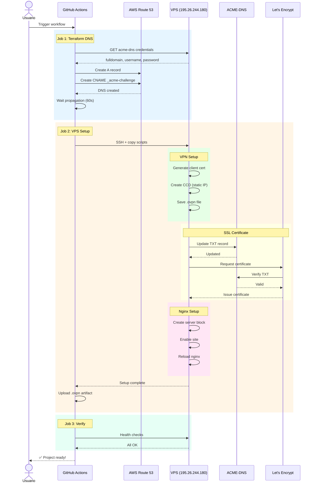

# 🚀 CI/CD Automation - VPS Gateway

## 📋 Arquitectura CI/CD Completa

```
┌─────────────────────────────────────────────────────────────────────────┐
│                           GITHUB ACTIONS                                 │
│                          (Repositorio GitHub)                            │
│                                                                         │
│  ┌─────────────────────────────────────────────────────────────────┐   │
│  │  Workflow: create-project.yml                                   │   │
│  │  ├─ Job 1: terraform-dns                                        │   │
│  │  │   ├─ Obtiene credenciales acme-dns (desde VPS)              │   │
│  │  │   ├─ Ejecuta Terraform LOCAL → AWS Route 53                 │   │
│  │  │   │   ├─ Registro A: proyecto.vps1 → 195.26.244.180        │   │
│  │  │   │   └─ CNAME: _acme-challenge → uuid.auth...             │   │
│  │  │   └─ Espera propagación DNS (60-120s)                      │   │
│  │  │                                                            │   │
│  │  ├─ Job 2: vps-setup (depende de terraform-dns)              │   │
│  │  │   ├─ SSH al VPS (195.26.244.180)                          │   │
│  │  │   ├─ Copia scripts y credenciales                          │   │
│  │  │   ├─ Ejecuta create-project-vps.sh                         │   │
│  │  │   │   ├─ VPN client (IP estática)                         │   │
│  │  │   │   ├─ SSL (Let's Encrypt + acme-dns)                  │   │
│  │  │   │   ├─ Nginx (reverse proxy)                            │   │
│  │  │   │   └─ Registro en projects.json                         │   │
│  │  │   └─ Upload artifact: .ovpn file                           │   │
│  │  │                                                            │   │
│  │  └─ Job 3: verify (depende de vps-setup)                     │   │
│  │      └─ Health check de todos los componentes                │   │
│  └─────────────────────────────────────────────────────────────────┘   │
│                                                                         │
│  ┌─────────────────────────────────────────────────────────────────┐   │
│  │  Workflow: manage-projects.yml                                  │   │
│  │  ├─ list: Lista proyectos, SSL, Nginx sites                   │   │
│  │  ├─ delete: Elimina proyecto (VPN + SSL + Nginx)              │   │
│  │  ├─ backup: Crea y descarga backup del PKI VPN                │   │
│  │  └─ verify: Health check del sistema                          │   │
│  └─────────────────────────────────────────────────────────────────┘   │
└─────────────────────────────────────────────────────────────────────────┘
                                    │
                    ┌───────────────┴───────────────┐
                    │                               │
                    ▼                               ▼
┌──────────────────────────┐          ┌──────────────────────────┐
│      AWS ROUTE 53        │          │   VPS (195.26.244.180)   │
│                          │          │                          │
│  ├─ A Records            │          │  ├─ OpenVPN              │
│  ├─ CNAME (ACME)         │          │  ├─ acme-dns             │
│  └─ NS Records           │          │  ├─ Nginx                │
│                          │          │  ├─ Let's Encrypt        │
└──────────────────────────┘          │  └─ Docker               │
                                      └──────────────────────────┘
                                                   │
                    ┌──────────────────────────────┴──────────────┐
                    │                                             │
                    ▼                                             ▼
┌──────────────────────────┐                         ┌──────────────────────────┐
│     CLIENTE LOCAL        │◄────── VPN Tunnel ─────►│    INTERNET             │
│                          │    (192.168.255.x)      │                          │
│  ├─ n8n (Docker)         │                         │  https://proyecto.vps1...│
│  └─ Otros servicios      │                         │                          │
│                          │                         │  Usuario final           │
└──────────────────────────┘                         └──────────────────────────┘
```

## 📁 Estructura de Archivos

```
.
├── .github/
│   └── workflows/
│       ├── create-project.yml      ⭐ Crea proyecto completo
│       └── manage-projects.yml     ⭐ Gestiona proyectos
│
├── terraform/
│   ├── main.tf                     ⭐ Recursos DNS
│   ├── variables.tf                ⭐ Variables
│   ├── outputs.tf                  ⭐ Outputs
│   ├── provider.tf                 ⭐ Provider AWS
│   └── modules/
│       └── projects/               ⭐ Módulo reutilizable
│
├── scripts/
│   ├── create-project-local.sh     ⭐ Script local (fallback)
│   ├── create-project-vps.sh       ⭐ Script VPS (10 pasos)
│   ├── setup-github-secrets.sh     ⭐ Configura secrets
│   └── ...
│
├── AGENTS.md                       ⭐ Especificación agents.md
├── README.md                       ⭐ Documentación general
└── CI_CD_GUIDE.md                  ⭐ Esta guía
```

## 🔐 GitHub Secrets Requeridos

| Secret | Descripción | Cómo Obtener |
|--------|-------------|--------------|
| `AWS_ACCESS_KEY_ID` | AWS Access Key | IAM Console → Usuario → Credenciales |
| `AWS_SECRET_ACCESS_KEY` | AWS Secret Key | IAM Console → Usuario → Credenciales |
| `VPS_SSH_KEY` | Clave SSH privada | `cat ~/.ssh/usuario_vps1_key` |

### Configurar Secrets

**Opción A: Script automático**
```bash
cd scripts
./setup-github-secrets.sh --repo=tu-usuario/vps-gateway
```

**Opción B: Manual**
```bash
# AWS Access Key
gh secret set AWS_ACCESS_KEY_ID --repo tu-usuario/vps-gateway --body "AKIA..."

# AWS Secret Key
gh secret set AWS_SECRET_ACCESS_KEY --repo tu-usuario/vps-gateway --body "..."

# VPS SSH Key
gh secret set VPS_SSH_KEY --repo tu-usuario/vps-gateway --body "$(cat ~/.ssh/usuario_vps1_key)"
```

## 🚀 Uso

### Crear Nuevo Proyecto

**Via GitHub Web:**
1. Ir a Actions → "Create Project - VPS Gateway"
2. Click "Run workflow"
3. Completar:
   - `project_name`: nombre-proyecto (solo minúsculas, números, guiones)
   - `client_name`: cliente-vpn (nombre único)
   - `local_port`: 5678 (puerto del servicio local)
4. Click "Run workflow"

**Via GitHub CLI:**
```bash
gh workflow run create-project.yml \
  --repo tu-usuario/vps-gateway \
  -f project_name=n8n-produccion \
  -f client_name=cliente-prod-01 \
  -f local_port=5678
```

### Flujo de Ejecución

```
1. Trigger: Manual (workflow_dispatch)
   ↓
2. Job: terraform-dns (2-3 min)
   ├─ Obtiene fulldomain de acme-dns
   ├─ Terraform apply → Route 53
   └─ Espera propagación DNS
   ↓
3. Job: vps-setup (3-5 min)
   ├─ SSH al VPS
   ├─ VPN client (IP estática)
   ├─ SSL certificate (Let's Encrypt)
   ├─ Nginx config (reverse proxy)
   └─ Registry update
   ↓
4. Job: verify (30s)
   └─ Health check de componentes
   ↓
5. Resultado: ✅ Proyecto creado
   ├─ URL: https://proyecto.vps1.dgetahgo.edu.mx
   ├─ VPN: Descargar artifact .ovpn
   └─ Listo para usar
```

### Gestionar Proyectos

**Listar todos:**
```bash
gh workflow run manage-projects.yml \
  --repo tu-usuario/vps-gateway \
  -f action=list
```

**Eliminar proyecto:**
```bash
gh workflow run manage-projects.yml \
  --repo tu-usuario/vps-gateway \
  -f action=delete \
  -f project_name=nombre-proyecto
```

**Crear backup:**
```bash
gh workflow run manage-projects.yml \
  --repo tu-usuario/vps-gateway \
  -f action=backup
```

**Verificar estado:**
```bash
gh workflow run manage-projects.yml \
  --repo tu-usuario/vps-gateway \
  -f action=verify
```

## 📊 Diagrama de Secuencia



## 🔧 Terraform

### Inicializar
```bash
cd terraform
terraform init
```

### Plan (dry-run)
```bash
terraform plan
```

### Apply (crear recursos)
```bash
terraform apply
```

### Variables Dinámicas

Para crear un proyecto específico:
```bash
cat > project.tfvars << EOF
subdomains = {
  "n8n-prod" = {
    name    = "n8n-prod.vps1.dgetahgo.edu.mx"
    type    = "A"
    ttl     = 300
    records = ["195.26.244.180"]
  }
}

acme_challenges = {
  "_acme-challenge.n8n-prod.vps1.dgetahgo.edu.mx" = "uuid.auth.dgetahgo.edu.mx."
}
EOF

terraform apply -var-file=project.tfvars
```

## 📈 Monitoreo

### Health Checks Automáticos

El workflow ejecuta verificaciones:
- ✅ VPN: Client CCD existe
- ✅ SSL: Certificado válido y no expirado
- ✅ Nginx: Config válida, servicio activo
- ✅ DNS: Resolución correcta

### Logs

**GitHub Actions:**
- Ir a Actions → Seleccionar workflow run → Ver logs

**VPS:**
```bash
# Log del script de creación
ssh usuario@195.26.244.180 "sudo tail -f /var/log/create-project.log"

# Log de Nginx
ssh usuario@195.26.244.180 "sudo tail -f /var/log/nginx/error.log"

# Log de Let's Encrypt
ssh usuario@195.26.244.180 "sudo tail -f /var/log/letsencrypt/letsencrypt.log"
```

## 🛠️ Troubleshooting

### "AWS credentials not found"
```bash
# Verificar secrets
gh secret list --repo tu-usuario/vps-gateway
```

### "SSH connection failed"
```bash
# Verificar clave SSH
ssh -i ~/.ssh/usuario_vps1_key usuario@195.26.244.180 echo "OK"

# Agregar a known_hosts
ssh-keyscan -H 195.26.244.180 >> ~/.ssh/known_hosts
```

### "DNS not propagating"
```bash
# Verificar manualmente
dig +short _acme-challenge.proyecto.vps1.dgetahgo.edu.mx CNAME
```

### "SSL certificate failed"
```bash
# En VPS, limpiar estado corrupto
sudo rm -rf /etc/letsencrypt/live/proyecto.vps1.dgetahgo.edu.mx
sudo rm -rf /etc/letsencrypt/renewal/proyecto.vps1.dgetahgo.edu.mx.conf
```

## 📝 Variables de Entorno

| Variable | Descripción | Default |
|----------|-------------|---------|
| `VPS_IP` | IP del VPS | 195.26.244.180 |
| `VPS_USER` | Usuario SSH | usuario |
| `DOMAIN` | Dominio base | vps1.dgetahgo.edu.mx |

## 🔄 Renovación Automática

Los certificados SSL se renuevan automáticamente via `certbot renew` (cron job en VPS).

Para forzar renovación:
```bash
ssh usuario@195.26.244.180 "sudo certbot renew --force-renewal"
```

## 📚 Recursos Adicionales

- [GitHub Actions Docs](https://docs.github.com/en/actions)
- [Terraform AWS Provider](https://registry.terraform.io/providers/hashicorp/aws/latest/docs)
- [Let's Encrypt](https://letsencrypt.org/docs/)
- [ACME-DNS](https://github.com/joohoi/acme-dns)

---

**Última actualización:** 2026-04-12  
**Versión:** 1.0.0
