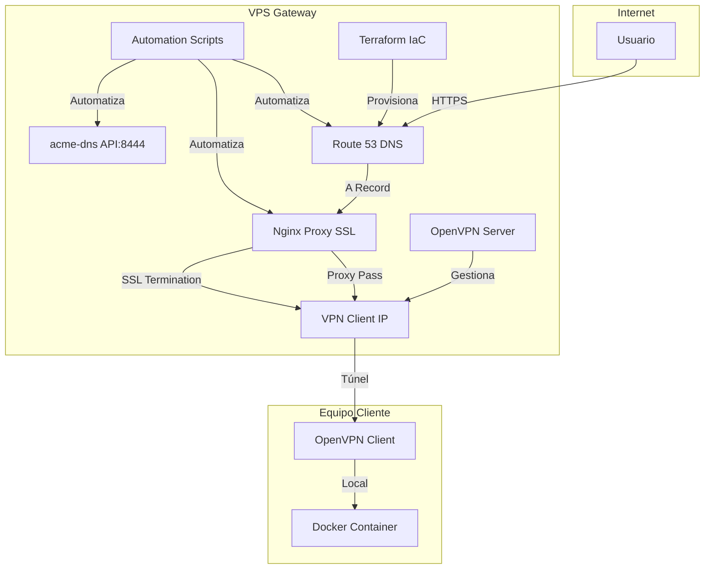
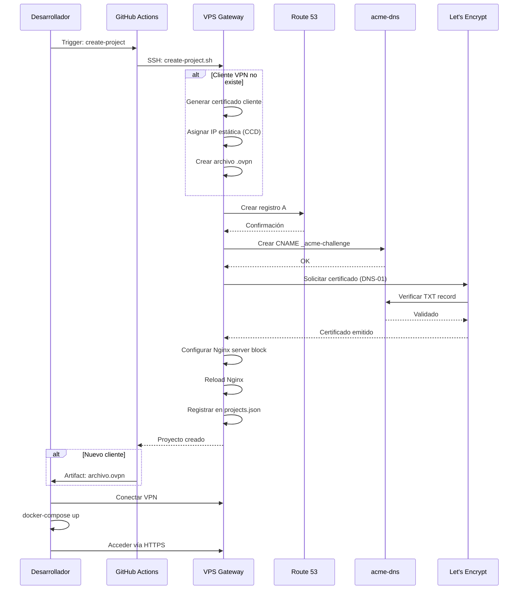

# DGETAHGO VPS Gateway - Documentación Técnica Completa

## Índice General

1. [Resumen Ejecutivo](#1-resumen-ejecutivo)
2. [Arquitectura del Sistema](#2-arquitectura-del-sistema)
3. [Componentes](#3-componentes)
4. [Flujo de Datos](#4-flujo-de-datos)
5. [Guía de Instalación](#5-guía-de-instalación)
6. [Guía de Uso](#6-guía-de-uso)
7. [API y Endpoints](#7-api-y-endpoints)
8. [Troubleshooting](#8-troubleshooting)
9. [Referencias](#9-referencias)

---

## 1. Resumen Ejecutivo

### 1.1 Propósito

El **VPS Gateway DGETAHGO** es una plataforma de infraestructura que permite a equipos de desarrollo exponer aplicaciones Docker locales a Internet de forma segura, automatizada y escalable.

### 1.2 Características Principales

| Característica | Descripción |
|---------------|-------------|
| **Túnel Seguro** | VPN (OpenVPN) entre cliente y VPS |
| **URLs Personalizadas** | Subdominio por proyecto |
| **SSL Automático** | Certificados Let's Encrypt vía acme-dns |
| **Sin Configuración DNS** | Automatizado vía Route 53 |
| **Setup Rápido** | 2-3 minutos por proyecto |
| **Multi-proyecto** | Hasta 90 proyectos simultáneos |

### 1.3 Especificaciones Técnicas

```yaml
Servidor: vps1.dgetahgo.edu.mx
IP Pública: 195.26.244.180
Ubicación: Contabo VPS (Alemania)
OS: Ubuntu 24.04.4 LTS
Dominio Base: dgetahgo.edu.mx
Subdominio Proyectos: *.vps1.dgetahgo.edu.mx
```

---

## 2. Arquitectura del Sistema

### 2.1 Vista General

```
┌─────────────────────────────────────────────────────────────────────────────┐
│                              INTERNET                                       │
│                                                                             │
│  ┌─────────────────────────────────────────────────────────────────────┐   │
│  │                    vps1.dgetahgo.edu.mx                             │   │
│  │                    195.26.244.180                                   │   │
│  │                                                                      │   │
│  │  ┌─────────────┐   ┌─────────────┐   ┌─────────────────────────┐   │   │
│  │  │  Route 53   │   │   Nginx     │   │      OpenVPN Server     │   │   │
│  │  │     DNS     │──▶│  SSL/Proxy  │──▶│     192.168.255.1       │   │   │
│  │  │             │   │             │   │                         │   │   │
│  │  └─────────────┘   └──────┬──────┘   └──────────┬──────────────┘   │   │
│  │                           │                      │                  │   │
│  │              proyecto.vps1.dgetahgo.edu.mx:443   │                  │   │
│  │                           │          ════════════╪════VPN Tunnel════╪═══╪══╗
│  │                           │                      │                  │   │   ║
│  │                           ▼                      ▼                  │   │   ║
│  │                   ┌──────────────────────────────────────────┐     │   │   ║
│  │                   │         TÚNEL VPN (UDP 1194)             │     │   │   ║
│  │                   │         Subnet: 192.168.255.0/24         │     │   │   ║
│  └───────────────────┼──────────────────────────────────────────┘     │   │   ║
│                      │                                               │   │   ║
│                      ║                                               │   │   ║
└──────────────────────╪───────────────────────────────────────────────┘   │   ║
                       ║                                                   │   ║
                       ║  Cliente VPN: 192.168.255.10 (IP Estática)       │   ║
                       ╚═══════════════════════════════════════════╗      │   ║
                                                                   ║      │   ║
┌──────────────────────────────────────────────────────────────────╫──────┘   ║
│                     EQUIPO CLIENTE (Local)                       ║          ║
│                                                                  ║          ║
│  ┌──────────────────┐        ┌──────────────────────────────┐   ║          ║
│  │   OpenVPN Client │════════│    Proyecto Docker           │   ║          ║
│  │  192.168.255.10  │        │    Puerto: 3000              │═══╝          ║
│  └──────────────────┘        │    (React/Node/PHP/etc)      │              ║
│                              └──────────────────────────────┘              ║
│                                                                            ║
│  Flujo: HTTPS → Nginx → VPN (192.168.255.10) → Docker Local:3000          ║
└────────────────────────────────────────────────────────────────────────────╝
```

### 2.2 Diagrama de Componentes



### 2.3 Diagrama de Flujo de Creación



---

## 3. Componentes

### 3.1 OpenVPN Server

**Ubicación**: `/opt/openvpn/`
**Imagen**: `kylemanna/openvpn:latest`
**Puerto**: 1194/UDP

**Configuración CCD (Client Config Directory)**:
```bash
# /opt/openvpn/data/openvpn.conf
server 192.168.255.0 255.255.255.0
client-config-dir /etc/openvpn/ccd
ifconfig-pool-persist /etc/openvpn/ipp.txt 0
```

**Asignación de IPs**:
| Rango | Uso |
|-------|-----|
| 192.168.255.1 | Servidor VPN |
| 192.168.255.2-9 | Reservado (servicios VPS) |
| 192.168.255.10-100 | Proyectos (IPs estáticas) |
| 192.168.255.101-254 | Clientes dinámicos |

**Archivos CCD**:
```
/opt/openvpn/data/ccd/
├── cliente1          # Contenido: ifconfig-push 192.168.255.10 255.255.255.0
├── cliente2          # Contenido: ifconfig-push 192.168.255.11 255.255.255.0
└── cliente3          # Contenido: ifconfig-push 192.168.255.12 255.255.255.0
```

### 3.2 Nginx Proxy

**Versión**: 1.24.0
**Puertos**: 80 (HTTP), 443 (HTTPS)

**Configuración Típica por Proyecto**:
```nginx
server {
    listen 443 ssl http2;
    server_name proyecto.vps1.dgetahgo.edu.mx;
    
    ssl_certificate /etc/letsencrypt/live/proyecto.vps1.dgetahgo.edu.mx/fullchain.pem;
    ssl_certificate_key /etc/letsencrypt/live/proyecto.vps1.dgetahgo.edu.mx/privkey.pem;
    
    # SSL moderno
    ssl_protocols TLSv1.2 TLSv1.3;
    ssl_ciphers ECDHE-ECDSA-AES128-GCM-SHA256:ECDHE-RSA-AES128-GCM-SHA256;
    ssl_prefer_server_ciphers off;
    
    location / {
        proxy_pass http://192.168.255.10:3000;  # IP VPN del cliente
        proxy_http_version 1.1;
        
        # WebSocket support
        proxy_set_header Upgrade $http_upgrade;
        proxy_set_header Connection "upgrade";
        
        # Headers estándar
        proxy_set_header Host $host;
        proxy_set_header X-Real-IP $remote_addr;
        proxy_set_header X-Forwarded-For $proxy_add_x_forwarded_for;
        proxy_set_header X-Forwarded-Proto $scheme;
        
        # Timeouts para VPN
        proxy_connect_timeout 60s;
        proxy_send_timeout 60s;
        proxy_read_timeout 60s;
    }
}

server {
    listen 80;
    server_name proyecto.vps1.dgetahgo.edu.mx;
    return 301 https://$server_name$request_uri;
}
```

### 3.3 acme-dns

**Propósito**: Automatización de certificados SSL vía DNS-01 challenge
**Puerto DNS**: 53
**Puerto API**: 8444 (HTTPS)
**Dominio**: `auth.dgetahgo.edu.mx`

**Flujo de Certificación**:
```
1. Certbot solicita certificado para proyecto.vps1.dgetahgo.edu.mx
2. acme-dns-auth.py crea CNAME: _acme-challenge.proyecto → auth.dgetahgo.edu.mx
3. Let's Encrypt verifica TXT record vía auth.dgetahgo.edu.mx
4. Certificado emitido y guardado en /etc/letsencrypt/live/
```

### 3.4 Scripts de Automatización

**Ubicación**: `/opt/projects/scripts/`

| Script | Propósito | Parámetros |
|--------|-----------|------------|
| `create-project.sh` | Pipeline completo | `--project`, `--client`, `--port`, `[--client-exists]` |
| `delete-project.sh` | Eliminación | `--project`, `[--keep-client]` |
| `list-projects.sh` | Listado | `[--format=table\|json\|csv]` |
| `verify-vpn-client.sh` | Verificación | `client-name` |
| `configure-openvpn-ccd.sh` | Setup CCD | (ninguno) |

**Registro de Proyectos** (`/opt/projects/registry.json`):
```json
{
  "projects": {
    "mi-proyecto": {
      "client_name": "cliente1",
      "vpn_ip": "192.168.255.10",
      "local_port": 3000,
      "domain": "mi-proyecto.vps1.dgetahgo.edu.mx",
      "ssl": true,
      "created_at": "2026-04-12T20:30:00Z",
      "status": "active"
    }
  },
  "clients": {
    "cliente1": {
      "vpn_ip": "192.168.255.10",
      "created_at": "2026-04-12T20:30:00Z"
    }
  },
  "ip_pool": {
    "next_ip": 11
  }
}
```

### 3.5 Terraform IaC

**Estructura**:
```
terraform/
├── main.tf              # DNS records
├── variables.tf         # Variables
├── provider.tf          # AWS provider
├── backend.tf           # State backend
├── outputs.tf           # Outputs
├── terraform.tfvars     # Valores (gitignored)
└── modules/
    └── projects/        # Módulo reutilizable
```

**Uso**:
```bash
cd terraform/
terraform init
terraform plan
terraform apply -auto-approve
```

---

## 4. Flujo de Datos

### 4.1 Request HTTP Completo

```
1. Usuario escribe: https://tienda.vps1.dgetahgo.edu.mx
   
2. DNS Resolution:
   - Browser pregunta a DNS resolver
   - Route 53 responde: 195.26.244.180
   
3. TCP Handshake:
   - Browser ↔ Nginx (195.26.244.180:443)
   
4. TLS Handshake:
   - Nginx presenta certificado SSL
   - Certificado válido para *.vps1.dgetahgo.edu.mx
   
5. HTTP Request:
   GET /api/productos HTTP/1.1
   Host: tienda.vps1.dgetahgo.edu.mx
   
6. Nginx Proxy:
   - Lee server_name: tienda.vps1.dgetahgo.edu.mx
   - Busca upstream: 192.168.255.10:3000
   - Reenvía request vía VPN tunnel
   
7. VPN Tunnel:
   - Paquete encapsulado en UDP 1194
   - Viaja por Internet al equipo cliente
   
8. OpenVPN Client:
   - Desencapsula paquete
   - Entrega a interfaz tun0: 192.168.255.10
   
9. Docker Container:
   - Recibe en puerto 3000
   - Procesa request
   - Genera response
   
10. Return Path:
    - Response sigue ruta inversa
    - Nginx recibe y reenvía a usuario
    - Browser renderiza respuesta
```

### 4.2 Latencia Esperada

| Segmento | Latencia Típica |
|----------|----------------|
| DNS | 20-50ms |
| TCP Handshake | 30-100ms |
| TLS Handshake | 50-150ms |
| VPN Tunnel (mismo país) | 10-30ms |
| VPN Tunnel (internacional) | 50-200ms |
| Docker local | <1ms |
| **Total** | **100-500ms** |

---

## 5. Guía de Instalación

### 5.1 Requisitos del VPS

**Ya Configurado**:
- ✅ Ubuntu 24.04.4 LTS
- ✅ OpenVPN con CCD
- ✅ Nginx 1.24.0
- ✅ acme-dns
- ✅ Docker 29.1.3
- ✅ AWS CLI 2.34.29
- ✅ Python 3 + requests

**Configuración AWS**:
```bash
# ~/.aws/credentials
[default]
aws_access_key_id = AKIA...
aws_secret_access_key = ...

# ~/.aws/config
[default]
region = us-east-1
output = json
```

### 5.2 Configuración Inicial (One-time)

```bash
# 1. Configurar OpenVPN CCD
ssh usuario@195.26.244.180
sudo /opt/projects/scripts/configure-openvpn-ccd.sh

# 2. Verificar configuración
sudo docker exec openvpn cat /etc/openvpn/openvpn.conf | grep ccd
# Output: client-config-dir /etc/openvpn/ccd

# 3. Verificar directorios
ls -la /opt/projects/
ls -la /opt/openvpn/data/ccd/
```

### 5.3 Configuración GitHub Actions

**Secrets Requeridos**:

| Secret | Descripción | Obtención |
|--------|-------------|-----------|
| `VPS_SSH_KEY` | Llave privada SSH | `cat ~/.ssh/id_ed25519` |
| `AWS_ACCESS_KEY_ID` | AWS Access Key | AWS IAM Console |
| `AWS_SECRET_ACCESS_KEY` | AWS Secret Key | AWS IAM Console |

**Configuración**:
1. Ir a GitHub Repository → Settings → Secrets and variables → Actions
2. Agregar cada secret con su valor correspondiente

---

## 6. Guía de Uso

### 6.1 Crear Proyecto (GitHub Actions - Recomendado)

```bash
# 1. Ir a GitHub → Actions → "Create Project Gateway"
# 2. Click "Run workflow"
# 3. Completar formulario:
```

| Campo | Valor Ejemplo | Descripción |
|-------|---------------|-------------|
| `project_name` | `tienda-online` | Nombre del proyecto (URL) |
| `client_name` | `equipo-frontend` | Nombre del equipo/cliente |
| `local_port` | `3000` | Puerto Docker local |
| `client_exists` | `false` | ¿Cliente VPN ya existe? |

```bash
# 4. Ejecutar workflow
# 5. Esperar ~2-3 minutos
# 6. Descargar artifact: vpn-config-equipo-frontend.ovpn (si nuevo)
```

### 6.2 Configurar Cliente VPN

**Paso 1: Descargar Configuración** (si es nuevo cliente):
```bash
# Desde artifact de GitHub Actions
# O manualmente:
scp usuario@195.26.244.180:/home/usuario/vpn-clients/equipo-frontend.ovpn .
```

**Paso 2: Instalar OpenVPN Connect**:
- **macOS**: `brew install openvpn-connect` o descargar de openvpn.net
- **Windows**: Descargar de openvpn.net
- **Linux**: `sudo apt install openvpn`
- **iOS/Android**: App Store / Play Store → "OpenVPN Connect"

**Paso 3: Importar y Conectar**:
1. Abrir OpenVPN Connect
2. File → Import Profile → Desde archivo
3. Seleccionar `equipo-frontend.ovpn`
4. Click "Connect"
5. Verificar conexión: `ifconfig tun0` o `ip addr show tun0`

### 6.3 Iniciar Proyecto Docker

```bash
# En equipo cliente (con VPN conectada)
cd ~/proyectos/tienda-online/

# Iniciar Docker
docker-compose up -d

# Verificar funcionamiento local
curl http://localhost:3000
# O abrir navegador: http://localhost:3000
```

### 6.4 Acceder Públicamente

```
https://tienda-online.vps1.dgetahgo.edu.mx
```

**Verificación**:
```bash
# Desde cualquier lugar
curl -I https://tienda-online.vps1.dgetahgo.edu.mx
# HTTP/2 200
```

### 6.5 Ejemplo Completo: Desarrollador Juan

```bash
# === VPS (como admin) ===
ssh usuario@195.26.244.180 \
  "sudo /opt/projects/scripts/create-project.sh \
    --project=mi-webapp \
    --client=juan-laptop \
    --port=3000"

# Output esperado:
# ✅ PROYECTO CREADO EXITOSAMENTE
# URL: https://mi-webapp.vps1.dgetahgo.edu.mx
# VPN Config: /home/usuario/vpn-clients/juan-laptop.ovpn

# === Equipo de Juan ===

# 1. Descargar VPN config
scp usuario@195.26.244.180:/home/usuario/vpn-clients/juan-laptop.ovpn ~/Downloads/

# 2. Importar en OpenVPN Connect
# (Interfaz gráfica: Importar archivo)

# 3. Conectar VPN
# (Click en "Connect")

# 4. Verificar conexión VPN
ping 192.168.255.1
# PING 192.168.255.1: 64 bytes from 192.168.255.1: icmp_seq=0 ttl=64 time=15.3 ms

# 5. Iniciar proyecto
cd ~/proyectos/mi-webapp/
docker-compose up -d

# 6. Verificar localmente
curl http://localhost:3000
# <!DOCTYPE html>... (HTML de la app)

# 7. Probar públicamente
curl https://mi-webapp.vps1.dgetahgo.edu.mx
# Misma respuesta, pero vía HTTPS

# 8. Compartir URL con equipo
# "Nuestra app está en: https://mi-webapp.vps1.dgetahgo.edu.mx"
```

---

## 7. API y Endpoints

### 7.1 Scripts como API

Los scripts en `/opt/projects/scripts/` funcionan como API de línea de comandos:

#### Crear Proyecto

```bash
POST /opt/projects/scripts/create-project.sh
Content-Type: application/x-www-form-urlencoded

project=nombre-proyecto&
client=nombre-cliente&
port=3000&
client_exists=false
```

**Respuesta**:
```
======================================
✅ PROYECTO CREADO EXITOSAMENTE
======================================

📋 Información del Proyecto:
   Nombre:     nombre-proyecto
   Cliente:    nombre-cliente
   VPN IP:     192.168.255.10
   Puerto:     3000

🌐 Acceso Público:
   URL:        https://nombre-proyecto.vps1.dgetahgo.edu.mx
```

#### Listar Proyectos

```bash
GET /opt/projects/scripts/list-projects.sh
Accept: application/json

./list-projects.sh --format=json
```

**Respuesta**:
```json
{
  "projects": {
    "mi-proyecto": {
      "client_name": "cliente1",
      "vpn_ip": "192.168.255.10",
      "local_port": 3000,
      "domain": "mi-proyecto.vps1.dgetahgo.edu.mx",
      "ssl": true,
      "status": "active"
    }
  }
}
```

#### Verificar Cliente

```bash
GET /opt/projects/scripts/verify-vpn-client.sh

./verify-vpn-client.sh cliente1
```

**Respuesta**:
```
Verificando cliente: cliente1
======================================
✅ Certificado: EXISTE
   subject=CN = cliente1
   notAfter=Jul 15 20:34:05 2028 GMT

✅ CCD Config: EXISTE
   IP Estática: 192.168.255.10

✅ Archivo OVPN: EXISTE
   Ubicación: /home/usuario/vpn-clients/cliente1.ovpn
   Tamaño: 4.9K

🟢 Estado: CONECTADO
   cliente1,192.168.255.10:49234,2026-04-12 20:45:00
```

### 7.2 GitHub Actions API

**Endpoint**: GitHub Actions REST API

```bash
# Trigger workflow
curl -X POST \
  -H "Authorization: token $GITHUB_TOKEN" \
  -H "Accept: application/vnd.github.v3+json" \
  https://api.github.com/repos/OWNER/REPO/actions/workflows/project-gateway.yml/dispatches \
  -d '{
    "ref": "main",
    "inputs": {
      "project_name": "mi-proyecto",
      "client_name": "mi-equipo",
      "local_port": "3000",
      "client_exists": "false"
    }
  }'
```

---

## 8. Troubleshooting

### 8.1 Problemas Comunes

#### Error: "No se puede conectar a https://proyecto.vps1.dgetahgo.edu.mx"

**Diagnóstico**:
```bash
# 1. Verificar DNS
dig +short proyecto.vps1.dgetahgo.edu.mx @8.8.8.8
# Debe responder: 195.26.244.180

# 2. Verificar Nginx
ssh usuario@195.26.244.180 "sudo nginx -t"

# 3. Verificar configuración existe
ssh usuario@195.26.244.180 "ls -la /etc/nginx/sites-enabled/ | grep proyecto"

# 4. Verificar certificado SSL
ssh usuario@195.26.244.180 "sudo certbot certificates | grep proyecto"
```

**Soluciones**:
| Causa | Solución |
|-------|----------|
| DNS no propagado | Esperar 5 minutos (TTL 300) |
| Nginx config rota | `sudo nginx -t && sudo systemctl reload nginx` |
| Certificado no existe | Re-ejecutar create-project.sh |
| Puerto 80/443 bloqueado | Verificar firewall: `sudo ufw status` |

#### Error: "502 Bad Gateway"

**Causa**: Nginx no puede conectar al backend VPN

**Diagnóstico**:
```bash
# 1. Verificar cliente conectado
ssh usuario@195.26.244.180 \
  "sudo docker exec openvpn cat /tmp/openvpn-status.log | grep cliente1"

# 2. Verificar IP alcanzable
ssh usuario@195.26.244.180 \
  "ping -c 3 192.168.255.10"

# 3. Verificar puerto abierto
ssh usuario@195.26.244.180 \
  "nc -zv 192.168.255.10 3000"

# 4. Verificar logs Nginx
ssh usuario@195.26.244.180 \
  "sudo tail -20 /var/log/nginx/proyecto-error.log"
```

**Soluciones**:
| Causa | Solución |
|-------|----------|
| VPN desconectada | Reconectar OpenVPN en cliente |
| Docker no corriendo | `docker-compose up -d` en cliente |
| Firewall local bloquea | `sudo ufw allow from 192.168.255.0/24` |
| Puerto incorrecto | Verificar docker-compose expone puerto correcto |

#### Error: "VPN no conecta"

**Diagnóstico**:
```bash
# En cliente
openvpn --config cliente.ovpn --verb 3

# Verificar certificado no revocado
ssh usuario@195.26.244.180 \
  "openssl crl -in /opt/openvpn/data/pki/crl.pem -text | grep cliente1"
```

**Soluciones**:
| Causa | Solución |
|-------|----------|
| Certificado revocado | Recrear cliente con create-project.sh |
| .ovpn corrupto | Descargar nuevamente del VPS |
| Puerto 1194 bloqueado | Usar VPN sobre TCP 443 (fallback) |
| TAP/TUN no disponible | `sudo modprobe tun` en Linux |

### 8.2 Logs Importantes

```bash
# OpenVPN
ssh usuario@195.26.244.180 "sudo docker logs openvpn --tail 100"

# Nginx
ssh usuario@195.26.244.180 "sudo tail -f /var/log/nginx/error.log"

# Scripts
ssh usuario@195.26.244.180 "sudo tail -f /var/log/vpn-scripts.log"

# acme-dns
ssh usuario@195.26.244.180 "sudo journalctl -u acme-dns -f"
```

---

## 9. Referencias

### 9.1 Documentación del Proyecto

| Documento | Descripción | Ubicación |
|-----------|-------------|-----------|
| `PROJECT.md` | Documentación general del VPS | `/home/usuario/servcontabo/` |
| `AGENTS.md` | Skills registry (agents.md format) | `/home/usuario/servcontabo/` |
| `PROPUESTA_ARQUITECTURA.md` | Diseño técnico original | `/home/usuario/servcontabo/` |
| `GATEWAY_README.md` | Guía de usuario | `/home/usuario/servcontabo/` |
| `IMPLEMENTACION.md` | Detalles de implementación | `/home/usuario/servcontabo/` |
| `RESUMEN_IMPLEMENTACION.md` | Resumen ejecutivo | `/home/usuario/servcontabo/` |

### 9.2 Skills

| Skill | Descripción | Path |
|-------|-------------|------|
| `dgetahgo-server-acme` | ACME-DNS SSL management | `skills/dgetahgo-server-acme/` |
| `dgetahgo-server-nginx` | Nginx reverse proxy | `skills/dgetahgo-server-nginx/` |
| `dgetahgo-server-route53` | AWS Route 53 DNS | `skills/dgetahgo-server-route53/` |
| `dgetahgo-server-docker` | Docker containers | `skills/dgetahgo-server-docker/` |
| `dgetahgo-server-openvpn` | OpenVPN server | `skills/dgetahgo-server-openvpn/` |
| `dgetahgo-server-cicd` | CI/CD automation | `skills/dgetahgo-server-cicd/` |
| `dgetahgo-server-terraform` | Terraform IaC | `skills/dgetahgo-server-terraform/` |

### 9.3 Recursos Externos

- **OpenVPN**: https://openvpn.net/community-resources/
- **kylemanna/docker-openvpn**: https://github.com/kylemanna/docker-openvpn
- **Nginx Reverse Proxy**: https://docs.nginx.com/nginx/admin-guide/web-server/reverse-proxy/
- **Let's Encrypt**: https://letsencrypt.org/docs/
- **acme-dns**: https://github.com/joohoi/acme-dns
- **AWS Route 53**: https://docs.aws.amazon.com/route53/
- **Terraform**: https://www.terraform.io/docs/

### 9.4 Comandos Rápidos

```bash
# Crear proyecto
ssh usuario@195.26.244.180 "sudo /opt/projects/scripts/create-project.sh --project=X --client=Y --port=3000"

# Listar proyectos
ssh usuario@195.26.244.180 "/opt/projects/scripts/list-projects.sh"

# Verificar VPN
ssh usuario@195.26.244.180 "/opt/projects/scripts/verify-vpn-client.sh CLIENTE"

# Ver clientes conectados
ssh usuario@195.26.244.180 "sudo docker exec openvpn ovpn_status"

# Renovar SSL
ssh usuario@195.26.244.180 "sudo certbot renew"

# Restart OpenVPN
ssh usuario@195.26.244.180 "cd /opt/openvpn && sudo docker compose restart"

# Restart Nginx
ssh usuario@195.26.244.180 "sudo systemctl reload nginx"
```

---

## 10. Glosario

| Término | Definición |
|---------|------------|
| **CCD** | Client Config Directory - Directorio de configuración por cliente en OpenVPN |
| **IaC** | Infrastructure as Code - Infraestructura como código (Terraform) |
| **PKI** | Public Key Infrastructure - Infraestructura de claves públicas (certificados) |
| **TTL** | Time To Live - Tiempo de vida de registros DNS |
| **OVPN** | Archivo de configuración de OpenVPN |
| **TUN** | Interfaz de red virtual (túnel VPN) |
| **ACME** | Automated Certificate Management Environment - Protocolo Let's Encrypt |
| **DNS-01** | Tipo de challenge ACME usando registros DNS |

---

**Documentación generada**: 2026-04-12  
**Versión**: 1.0  
**Estado**: Completa  
**Autor**: Infrastructure Team - DGETAHGO

---

*Para actualizaciones, ver el repositorio de documentación del proyecto.*
